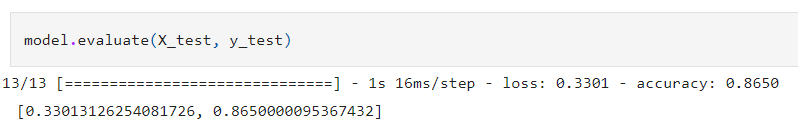

# NLP_LeagueOfLegends

League of Legends (LoL) is a popular online video game [1]. In this game, players form teams and face off in a virtual arena, assuming the role of "champions" with unique abilities. The main objective is to destroy the enemy "Nexus," a structure located in the enemy's base, while defending one's own Nexus.

During the matches, players take control of champions and collaborate as a team to confront enemy champions, defeat neutral monsters, destroy enemy turrets, and advance on the map. As they progress, champions gain experience, level up, and acquire abilities and items to enhance their combat performance.

There are websites that provide feedback on a player's performance through analysis of their post-match statistics using labels. One such website is leagueofgraphs.com [2].

## Prediction of match results based on labels
The objective of the project was to use natural language processing (NLP) to predict the outcomes of League of Legends matches based on text labels. The problem was approached as a binary prediction of winning or losing.

The project consists of 3 files: "poroModel", which is the predictive model for match results based on labels, "PoroScraping", which is the means through which the dataset (200_games.csv) was obtained, and "poros.py", which is a library with specific functions for the operation of both aforementioned codes.

TensorFlow and Keras were used to build a recurrent neural network (RNN) that would make the predictions. The network architecture included Embedding layers, Bidirectional GRU layers, and a Dense layer with a sigmoid activation function.

As mentioned, the dataset was built from collected information, and it is in Spanish. Therefore, the model is only capable of processing information in Spanish. For other languages, small modifications would be needed, along with collecting data in that specific language. Regarding the type of labels, they are as follows:

## Code Structure
Data preprocessing was performed using the Keras Tokenizer library. This involved cleaning null values, splitting the data into training and testing sets, learning the vocabulary, converting texts into sequences of integers, and applying padding to obtain sequences of uniform length.

The model was compiled with the Adam optimizer, binary_crossentropy loss function, and accuracy metric, as this configuration yielded the best results.

During model training, EarlyStopping was used to stop training if no improvement in loss was observed after a specified number of epochs.

To make predictions with the trained model, a new input data was provided after undergoing the same preprocessing steps as the training data. This included tokenizing the text and applying padding to obtain sequences of the same length as those used during training.

The model predictions were obtained using the poros.new() function. The prediction results are numerical values representing the probability of winning. To interpret the results as wins or losses, a threshold (0.5) can be applied, considering values above that threshold as victories (1) and values below as losses (0).

## Result
The trained model ("8650_3301m2.h5") presented is the one that yielded the best results according to the loss (\~33%) and accuracy metrics(\~%87).

In the PoroModel.ipynb code, there is a section at the end where we can test the model by entering new values in the following format:

    nuevo_dato = 'Derrota a pesar de ventaja, Baja participación en muertes'
    
Please note that the model was trained in Spanish, so the new input should also be in Spanish.

## Medical field Applications of NLP
Some applications that natural language processing models can have in the medical field are:

-Sentiment analysis in patient comments: analyzing patient comments and opinions on social media or medical service review platforms. This could provide valuable feedback on the quality of medical services and help identify areas for improvement.

-Clinical report generation: automatically generating clinical reports from structured and unstructured data. This could save time for healthcare professionals and ensure consistent and accurate reports.

## References
>[1] Riot Games. (2009). "League of Legends" [Game]. https://leagueoflegends.com/ (accessed on 4 July 2023).

>[2] League of Graphs. https://www.leagueofgraphs.com/ (accessed on 4 July 2023).
